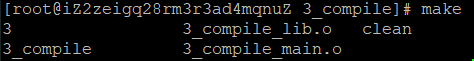

## g++
1. 预处理——替换头文件、宏等
   - g++ -E main.cpp > output.cpp
   - 把内容输出到output.cpp文件，否则仅在命令行显示
2. 编译——做语法检查，语法没错误就可以生成对象文件
   - g++ -I ./include -c main.cpp
     - 因此函数只有声明，没有定义是可以通过该编译阶段的
   - nm -C main.o查看编译后的内容
     - 前面有数字的、带T的，是该文件定义的函数
     - 没数字的、带U的，是外部文件定义的函数
3. 链接——链接各个对象文件或库文件，查找相关函数定义的匹配
   - g++ main.o other.o
   - g++ -L ./lib main.o -lpthread
   - 该阶段可能的错误：
     - 定义缺失：undefined reference to `func(int, int)'
     - 定义重复：multiple definition of `func(int, int)'


## makefile使用笔记
- 一般格式:
    ```cmake
    target ... : prerequisites ...
        command #前面要有tab！！
    ```
- 例子：
    ```cmake
    compile: compile_lib.o compile_main.o
	    g++ -o compile compile_lib.o compile_main.o
    compile_lib.o: compile_lib.cc
	    g++ -c compile_lib.cc
    compile_main.o: compile_main.cpp
	    g++ -c compile_main.cpp
    clean:
	    rm *.o compile
    3:
	    g++ main.cpp -o 3
    ```
- make文件的target会在命令行中进行自动补全
- 