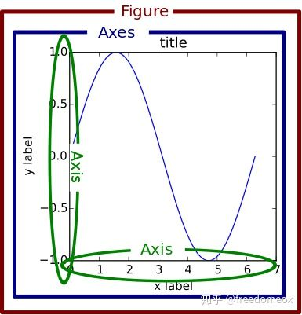
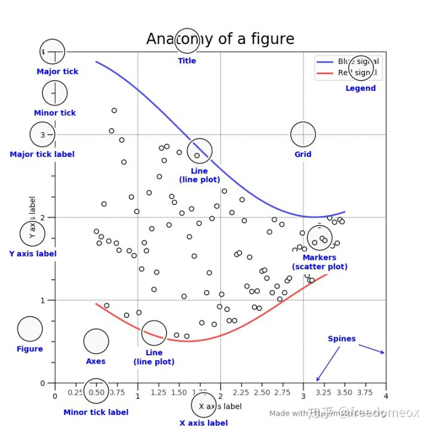
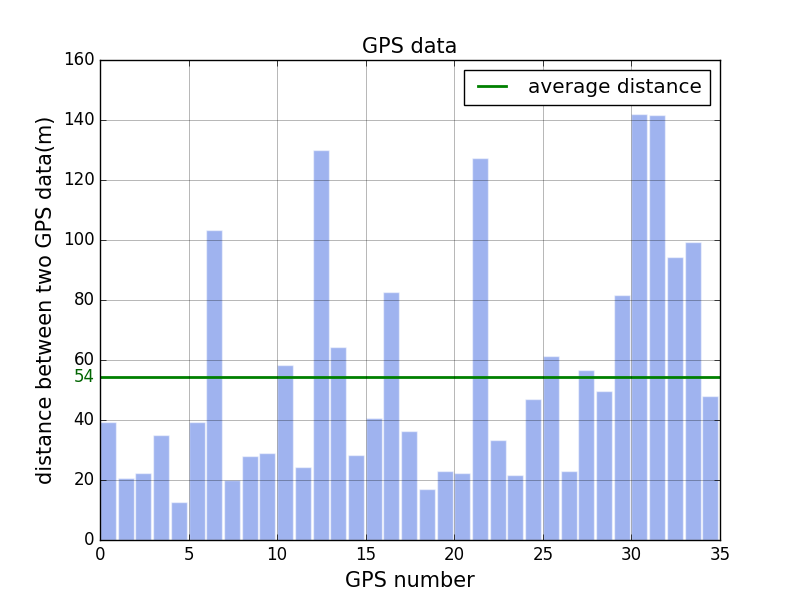

## Matplotlib画图
- 有两种画图方式：
  - plt.xxx，如plt.figure()，通过matplotlib提供的api，快速画图，但无法细致精调
  - fig, ax = plt.subplots()，指定figure和axes，然后对axes单独操作
- 
- 
- Figure
  - fig = plt.figure()，可以解释为画布
  - 画图的第一件事，就是创建一个画布figure，然后在这个画布上加各种元素。
- Axes
  - ax = fig.add_subplot(1,1,1)#或111
  - 可以把axes理解为你要放到画布上的各个物体
  - figure只有一张图，那么只有一个axes;如果figure有subplot，那么每一个subplot就是一个axes
  - axes下可以修改编辑的变量非常多
- Axis
  - ax.xaxis/ax.yaxis,xy坐标轴
  - 每个坐标轴由竖线和数字组成的
    - 每一个竖线是一个axis的subplot
    - 因此ax.xaxis存在axes这个对象，对这个axes进行编辑就会修改xaxis图像上的表现
- 画图
  1. 生成画布
    ```python
    fig, ax = plt.subplots(figsize=(14,7))
    # fig, ax = plt.subplots(2,1,figsize(14,7))
    # ax[0].***
    # ax[1].***
    ```
  2. 画线
    ```python
    ax.plot(range(len(a)), a)
    ```
  3. 标题、xy坐标轴标题
    ```python
    ax.set_title()
    ax.set_xlabel()
    ax.set_ylabel()
    ax.legend()
    ax.set_aspect('equal') 
    ax.minorticks_on() 
    ax.set_xlim(0,16) 
    ax.grid(which='minor', axis='both')
    ```
  4. 坐标轴tick和细节
    ```python
    ax.xaxis.set_tick_params(rotation=45,labelsize=18,colors='w')
    start, end = ax.get_xlim() 
    ax.xaxis.set_ticks(np.arange(start, end,1)) 
    ax.yaxis.tick_right()
    ```
- 例子：统计GPS之间的距离间隔并绘制曲线（直方图+平均线）
- 
    ```python 
    # distance_list stores distances  between two GPS data
    # distance_list_np = np.array(distance_list)

    #alternative: fig, ax=plt.subplots(facecolor='snow')
    fig = plt.figure(facecolor='snow')
    ax = fig.add_subplot(111)

    ax.bar(range(len(distance_list)), distance_list,width=0.9, color="royalblue",edgecolor='white',alpha=0.5)#,hatch="/"
    ax.axhline(distance_list_np.mean(),color="green",linewidth=2.0, label="average distance")

    trans = transforms.blended_transform_factory(
        ax.get_yticklabels()[0].get_transform(), ax.transData)
    ax.text(0,distance_list_np.mean(), "{:.0f}".format(distance_list_np.mean()), color="darkgreen", transform=trans, 
            ha="right", va="center")

    ax.legend()
    ax.set_xlabel("GPS number",fontsize=15)
    ax.set_ylabel("distance between two GPS data(m)",fontsize=15)
    ax.set_title("GPS data",fontsize=15)
    ax.grid(ls='-',which="major",alpha=0.4)
    plt.show() 
    ```