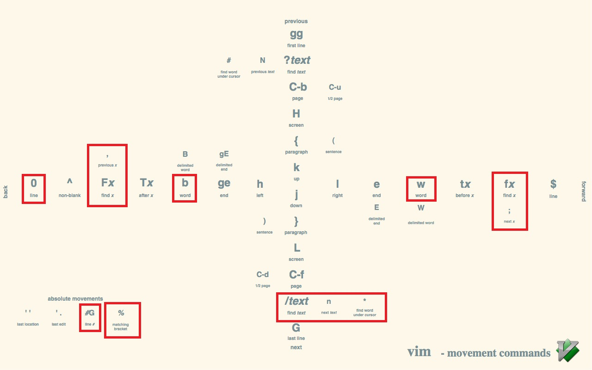

# Vim使用笔记

## 1. 显示配置
1. 重命名文件
   - :w newfile
   - 将编辑的内容写入 newfile 文件，并保持原有文件的内容不变
2. 显示行号
   - :set nu(mber)     打开
   - :set nonu(mber)   关闭
3. tab键显示为4个空格
   - :set tabstop=4
4. 修改颜色
    |命令|修改内容|
    |---|---|
    |:hi Comment ctermfg =blue|注释颜色|
    |:hi String ctermfg =darkred|字符串颜色|
    |:hi Type ctermfg =yellow|类型颜色|
    |:hi Number ctermfg =darkblue|数字颜色|
    |:hi Constant ctermfg =blue|常量颜色|
    |:hi Statement ctermfg =darkyellow|声明颜色|
5. 保存显示配置
   - 为了避免每次开vim都要重新设置一遍需要的配置，将配置写入~/.vimrc文件，每次打开vim自动加载配置
   - vimrc里不用输冒号

## 2. 命令模式
1. 复制粘贴
    |命令|效果|
    |:---:|---|
    |(x)yy|复制光标所在的(x)整行|
    |yw|复制单词|
    |p|粘贴|
    - 另外，选中后右键也会在光标处自动粘贴
2. 删除
    |命令|效果|
    |:---:|---|
    |(x)dd|删除光标所在的(x)整行|
    |dw|删除一个单词（光标需在单词头部）|
    |x|删除单个字符|
3. 撤销
    |命令|效果|
    |:---:|---|
    |u|撤销|
    |ctrl+r|恢复撤销|
4. 光标移动

    |常用命令|效果|
    |:---:|---|
    |垂直方向移动|
    |G|**转到文档末尾**|
    |#G|**转到第#行**|
    |gg|**转到文档头**|
    |}|下一个段落（空行分隔的就是段落）|
    |%|匹配的括号|
    |/text|**查找所有text**|
    |n|**下一个text**|
    |*|**查找当前光标处的词**|
    |:noh|**取消查找的高亮（或查找不存在的字符）**|
    |水平方向移动|
    |0|行首|
    |$|行尾|
    |b|前一个单词|
    |w|后一个单词|
    

## 3. 编辑模式
- 进入编辑模式
  - o 新开一行插入
  - i 当前光标位置插入
  - a 当前光标位置后插入（**光标在命令模式的行尾时，按a可以直接到编辑模式的行尾**）